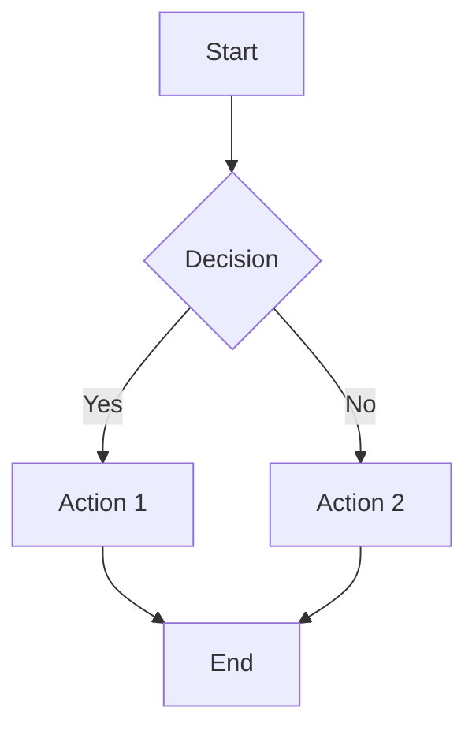
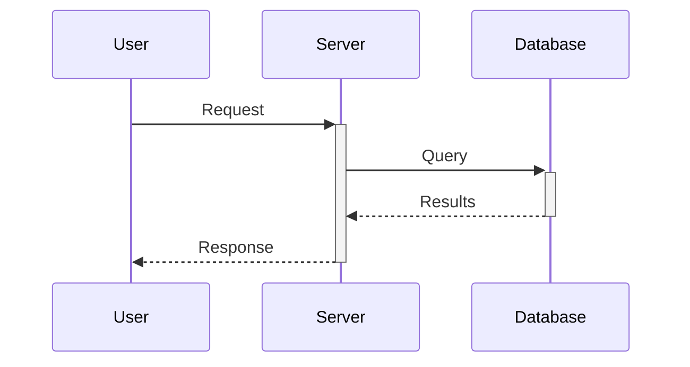
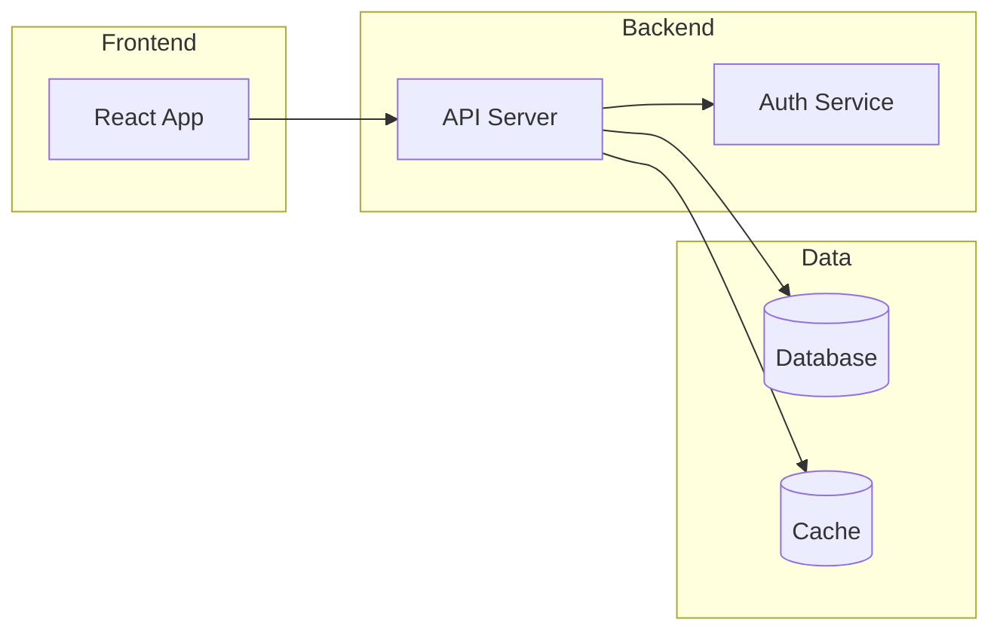

# Claude Office Skills - Complete Bundle

> This file contains all 77+ skills bundled together. Add this single file to Claude Desktop Project Knowledge for instant access to all skills.

---

## How to Use This File

1. **In Claude Desktop**: Create a new Project → Add this file to Project Knowledge
2. **Ask Claude**: "Use the [skill-name] skill to [your task]"

---

## Finance & Investment Skills

### stock-analysis

**Purpose**: Analyze stocks with fundamental and technical analysis frameworks.

**When to use**: Stock investment research, earnings analysis, valuation comparison

**Framework**:
1. Company Overview: Business model, revenue streams, competitive position
2. Financial Analysis: Revenue growth, margins, cash flow, debt levels
3. Valuation: P/E, P/S, EV/EBITDA vs peers and historical
4. Technical: Price trends, support/resistance, momentum indicators
5. Catalysts: Upcoming events, earnings, product launches
6. Risks: Competition, regulation, macro factors
7. Recommendation: Buy/Hold/Sell with price targets

**Output Format**:
```markdown
# Stock Analysis: [TICKER]

## Executive Summary
- **Recommendation**: [Buy/Hold/Sell]
- **Current Price**: $XX | **Target Price**: $XX
- **Upside/Downside**: XX%

## Company Overview
[Business description, market position, competitive advantages]

## Financial Analysis
| Metric | Current | YoY Change |
|--------|---------|------------|
| Revenue | $XXB | +XX% |
| Net Income | $XXB | +XX% |
| Free Cash Flow | $XXB | +XX% |

## Valuation
| Multiple | Company | Industry Avg |
|----------|---------|--------------|
| P/E | XX | XX |
| P/S | XX | XX |
| EV/EBITDA | XX | XX |

## Investment Thesis
[Bull case and bear case]

## Risks
[Key risk factors]

## Conclusion
[Final recommendation with rationale]
```

---

### dcf-valuation

**Purpose**: Build Discounted Cash Flow models to value companies.

**When to use**: Company valuation, M&A analysis, investment decisions

**Framework**:
1. Historical Analysis: 3-5 years of financial data
2. Revenue Projections: 5-10 year forecast with growth assumptions
3. Margin Projections: Operating and net margin evolution
4. Free Cash Flow: EBIT(1-t) + D&A - CapEx - ΔNWC
5. Terminal Value: Gordon Growth or Exit Multiple
6. WACC Calculation: Cost of equity + Cost of debt
7. Present Value: Discount FCF and terminal value
8. Sensitivity Analysis: Key variable ranges

**WACC Formula**:
```
WACC = (E/V × Re) + (D/V × Rd × (1-T))

Where:
- Re = Risk-free rate + Beta × Market risk premium
- Rd = Cost of debt
- T = Tax rate
- E/V = Equity weight
- D/V = Debt weight
```

**Output Format**:
```markdown
# DCF Valuation: [Company]

## Assumptions
| Parameter | Value | Rationale |
|-----------|-------|-----------|
| Revenue Growth (Y1-5) | XX% | [reason] |
| Terminal Growth | X% | [reason] |
| WACC | X.X% | [calculation] |

## Free Cash Flow Projections
| Year | Revenue | EBIT | FCF |
|------|---------|------|-----|
| 2024 | $XXM | $XXM | $XXM |
| ... | ... | ... | ... |

## Valuation Summary
- **Enterprise Value**: $XXM
- **Less: Net Debt**: $XXM
- **Equity Value**: $XXM
- **Shares Outstanding**: XXM
- **Implied Share Price**: $XX

## Sensitivity Analysis
| WACC / Terminal Growth | 2% | 2.5% | 3% |
|------------------------|-----|------|-----|
| 9% | $XX | $XX | $XX |
| 10% | $XX | $XX | $XX |
| 11% | $XX | $XX | $XX |
```

---

### financial-modeling

**Purpose**: Build integrated 3-statement financial models.

**When to use**: Financial planning, scenario analysis, fundraising

**Model Structure**:
1. **Income Statement**: Revenue → COGS → Gross Profit → OpEx → EBIT → Net Income
2. **Balance Sheet**: Assets = Liabilities + Equity
3. **Cash Flow Statement**: Operating + Investing + Financing = Δ Cash

**Key Linkages**:
- Net Income → Retained Earnings
- D&A → CFO and PP&E rollforward
- CapEx → PP&E and CFI
- Working Capital → CFO

---

### company-research

**Purpose**: Conduct comprehensive company due diligence.

**Framework**:
1. Business Model Canvas
2. Market Analysis (TAM/SAM/SOM)
3. Competitive Landscape (Porter's Five Forces)
4. SWOT Analysis
5. Management Assessment
6. Financial Health Check
7. ESG Considerations

---

### investment-memo

**Purpose**: Write professional investment committee memos.

**Structure**:
1. Executive Summary (1 page max)
2. Investment Thesis
3. Business Overview
4. Market Opportunity
5. Financial Analysis
6. Valuation
7. Risk Factors
8. Terms & Structure
9. Recommendation

---

### crypto-report

**Purpose**: Analyze cryptocurrency and blockchain projects.

**Framework**:
1. Project Overview: Purpose, technology, team
2. Tokenomics: Supply, distribution, utility
3. On-chain Metrics: Active addresses, TVL, transaction volume
4. Competitive Analysis: Similar projects comparison
5. Technical Analysis: Price action, support/resistance
6. Risk Assessment: Regulatory, technical, market risks

---

## Research Skills

### deep-research

**Purpose**: Conduct comprehensive multi-angle research on any topic.

**Process**:
1. **Define Scope**: Clarify research questions and boundaries
2. **Source Mapping**: Identify primary and secondary sources
3. **Data Collection**: Gather from multiple perspectives
4. **Analysis**: Synthesize findings, identify patterns
5. **Validation**: Cross-reference, fact-check
6. **Synthesis**: Create coherent narrative with citations

**Output Format**:
```markdown
# Research Report: [Topic]

## Executive Summary
[Key findings in 3-5 bullets]

## Methodology
[Research approach and sources used]

## Findings
### [Finding 1]
[Detail with evidence and citations]

### [Finding 2]
[Detail with evidence and citations]

## Analysis
[Interpretation and implications]

## Conclusion
[Summary and recommendations]

## References
[Numbered citation list]
```

---

### competitive-analysis

**Purpose**: Systematic competitor analysis framework.

**Framework**:
1. Competitor Identification (direct, indirect, potential)
2. Product/Service Comparison Matrix
3. Pricing Analysis
4. Market Positioning Map
5. SWOT per Competitor
6. Strategy Assessment
7. Threat Level Rating

---

### academic-search

**Purpose**: Research academic literature effectively.

**Process**:
1. Define research question (PICO format if applicable)
2. Identify keywords and synonyms
3. Search databases (Google Scholar, PubMed, Scopus)
4. Filter by date, citations, relevance
5. Extract key findings
6. Synthesize with proper citations

---

## Visualization Skills

### image-generation

**Purpose**: Create effective AI image generation prompts for DALL-E, Midjourney, Stable Diffusion.

**Prompt Structure**:
```
[Subject] + [Style] + [Composition] + [Lighting] + [Mood] + [Technical specs]
```

**Example Prompts**:

**Professional Headshot**:
```
Professional corporate headshot, [description], studio lighting, 
neutral gray background, sharp focus, high resolution, 
Canon EOS R5, 85mm f/1.4 lens, professional photography
```

**Product Shot**:
```
Minimalist product photography, [product] on white surface, 
soft studio lighting, subtle shadows, clean composition, 
commercial photography style, 4K resolution
```

**Illustration**:
```
[Subject] in flat vector illustration style, 
modern corporate aesthetic, limited color palette of [colors], 
clean lines, no gradients, suitable for presentation slides
```

---

### diagram-creator

**Purpose**: Create professional diagrams using Mermaid, PlantUML, or D2.

**Mermaid Examples**:

**Flowchart**:


**Sequence Diagram**:


**Architecture**:


---

### chart-designer

**Purpose**: Design effective data visualizations.

**Chart Selection Guide**:
- **Comparison**: Bar chart, grouped bar
- **Trend over time**: Line chart, area chart
- **Part-to-whole**: Pie, donut, treemap
- **Distribution**: Histogram, box plot
- **Relationship**: Scatter plot, bubble chart
- **Geographic**: Map, choropleth

**Best Practices**:
1. Start y-axis at zero (for bar charts)
2. Use colorblind-friendly palettes
3. Minimize chart junk
4. Label directly when possible
5. Use consistent formatting

---

## Document Skills

### contract-review

**Purpose**: Analyze contracts for risks and completeness.

**Review Checklist**:
1. **Parties**: Correctly identified, legal capacity
2. **Scope**: Clear deliverables, acceptance criteria
3. **Payment**: Terms, milestones, penalties
4. **Term**: Duration, renewal, termination rights
5. **IP**: Ownership, licensing, pre-existing IP
6. **Liability**: Caps, indemnification, insurance
7. **Confidentiality**: Scope, duration, exceptions
8. **Dispute Resolution**: Governing law, venue, arbitration
9. **Force Majeure**: Events covered, notice requirements

**Risk Levels**:
- 🔴 High: Significant financial/legal exposure
- 🟡 Medium: Needs negotiation
- 🟢 Low: Standard/acceptable

---

### invoice-generator

**Purpose**: Create professional invoices.

**Required Fields**:
1. Invoice number (unique)
2. Date and due date
3. Seller information (name, address, tax ID)
4. Buyer information
5. Line items (description, quantity, unit price, amount)
6. Subtotal, tax, total
7. Payment instructions
8. Terms and conditions

---

### proposal-writer

**Purpose**: Write compelling business proposals.

**Structure**:
1. **Cover Page**: Title, client name, date
2. **Executive Summary**: Problem, solution, value proposition
3. **Understanding**: Client's challenges and goals
4. **Proposed Solution**: Approach, methodology, deliverables
5. **Timeline**: Phases, milestones, dates
6. **Team**: Key personnel, qualifications
7. **Investment**: Pricing, payment terms
8. **Case Studies**: Relevant past work
9. **Next Steps**: Call to action

---

## Communication Skills

### email-drafter

**Purpose**: Draft professional emails for various contexts.

**Templates**:

**Request Email**:
```
Subject: [Specific Request] - [Context/Project]

Hi [Name],

I hope this email finds you well. [Brief context if needed]

I'm reaching out to [specific request]. Specifically, I need:
1. [Item 1]
2. [Item 2]

[Reason why this is important/urgent if applicable]

Would you be able to [specific action] by [date]? Please let me know if you have any questions.

Thank you for your help.

Best regards,
[Your name]
```

**Follow-up Email**:
```
Subject: Re: [Original Subject] - Follow-up

Hi [Name],

I wanted to follow up on my previous email regarding [topic].

[Add any new information or context]

Please let me know if you need any additional information from my end.

Looking forward to hearing from you.

Best,
[Your name]
```

---

### meeting-notes

**Purpose**: Structure and summarize meeting notes.

**Template**:
```markdown
# Meeting Notes: [Meeting Title]

**Date**: [Date]
**Time**: [Start] - [End]
**Attendees**: [Names]

## Agenda
1. [Topic 1]
2. [Topic 2]

## Discussion Summary
### [Topic 1]
- [Key point]
- [Decision made]

### [Topic 2]
- [Key point]
- [Decision made]

## Action Items
| Action | Owner | Due Date |
|--------|-------|----------|
| [Task] | [Name] | [Date] |

## Next Meeting
- **Date**: [Date]
- **Topics**: [Preview]
```

---

### weekly-report

**Purpose**: Generate weekly status reports.

**Template**:
```markdown
# Weekly Report: [Week of Date]

## Summary
[2-3 sentence overview of the week]

## Accomplishments
- ✅ [Completed item 1]
- ✅ [Completed item 2]

## In Progress
- 🔄 [Ongoing item 1] - [X]% complete
- 🔄 [Ongoing item 2] - [X]% complete

## Blockers
- ⚠️ [Blocker 1] - [Impact and needed resolution]

## Next Week's Priorities
1. [Priority 1]
2. [Priority 2]

## Metrics
| Metric | This Week | Last Week | Change |
|--------|-----------|-----------|--------|
| [KPI 1] | XX | XX | +/-XX% |
```

---

## PDF Skills

### chat-with-pdf

**Purpose**: Extract information and answer questions about PDF documents.

**Process**:
1. Extract text content from PDF
2. Identify document structure (sections, tables)
3. Answer specific questions with page references
4. Summarize key points if requested

---

### pdf-extraction

**Purpose**: Extract structured data from PDFs.

**Capabilities**:
- Text extraction with formatting
- Table extraction to CSV/Excel format
- Image extraction
- Metadata extraction
- OCR for scanned documents

---

### pdf-merge-split

**Purpose**: Merge multiple PDFs or split by pages.

**Operations**:
- Merge: Combine multiple PDFs in order
- Split: Extract specific page ranges
- Reorder: Change page sequence
- Extract: Pull specific pages

---

## Presentation Skills

### ai-slides

**Purpose**: Generate presentation content and structure.

**Process**:
1. Define presentation goal and audience
2. Create outline with key messages
3. Generate slide content (title + 3-5 bullets)
4. Add speaker notes
5. Suggest visuals for each slide

**Slide Types**:
- Title slide
- Agenda/Overview
- Content (text, bullets)
- Data (charts, tables)
- Quote/Highlight
- Comparison
- Timeline
- Summary/Conclusion
- Q&A/Contact

---

### md-slides

**Purpose**: Convert markdown to presentation format.

**Reveal.js Format**:
```markdown
---
title: Presentation Title
---

# Slide 1 Title

Content for first slide

---

# Slide 2 Title

- Bullet point 1
- Bullet point 2

---

# Slide 3

```code
Code example
```

```

---

## Data Skills

### data-analysis

**Purpose**: Analyze spreadsheet data and generate insights.

**Process**:
1. Data Overview: Rows, columns, data types
2. Data Quality: Missing values, outliers, duplicates
3. Descriptive Statistics: Mean, median, distribution
4. Correlation Analysis: Relationships between variables
5. Trend Analysis: Time-based patterns
6. Segmentation: Group analysis
7. Visualization Recommendations
8. Key Insights Summary

---

### excel-automation

**Purpose**: Create Excel formulas and automation.

**Common Formulas**:
- Lookups: VLOOKUP, XLOOKUP, INDEX/MATCH
- Conditionals: IF, IFS, SWITCH
- Aggregation: SUMIF, COUNTIF, AVERAGEIF
- Text: CONCATENATE, LEFT, RIGHT, MID
- Date: TODAY, DATEDIF, WORKDAY
- Array: UNIQUE, FILTER, SORT

---

## Quick Reference

| Skill | Use When You Need To |
|-------|---------------------|
| stock-analysis | Analyze a stock for investment |
| dcf-valuation | Value a company |
| contract-review | Check a contract for risks |
| proposal-writer | Write a business proposal |
| email-drafter | Draft a professional email |
| data-analysis | Analyze spreadsheet data |
| diagram-creator | Create a diagram |
| image-generation | Generate AI images |
| deep-research | Research a topic thoroughly |
| meeting-notes | Structure meeting notes |

---

*Claude Office Skills - 77+ professional skills for office productivity*
*Add this file to Claude Desktop Project Knowledge for instant access*
