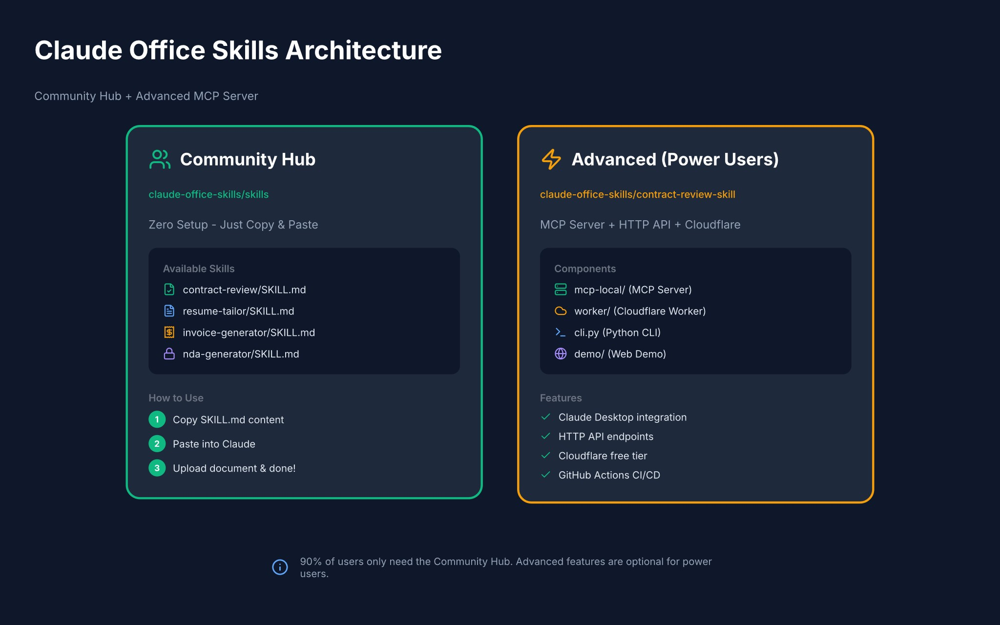

# Claude Office Skills

> A curated collection of practical Claude Skills for real-world office tasks. Zero setup required.

[](https://awesome.re)
[](https://opensource.org/licenses/MIT)
[](CONTRIBUTING.md)
[](#skills)

---

## Contents

- [What Are Claude Skills?](#what-are-claude-skills)
- [Getting Started](#getting-started)
- [Skills](#skills)
  - [Legal & Contracts](#legal--contracts)
  - [HR & Careers](#hr--careers)
  - [Finance & Business](#finance--business)
  - [Communication & Writing](#communication--writing)
  - [Productivity](#productivity)
  - [Document Processing](#document-processing)
- [Creating Skills](#creating-skills)
- [Advanced Usage](#advanced-usage)
- [Contributing](#contributing)
- [Resources](#resources)

---

## What Are Claude Skills?

**Claude Skills** are customizable workflows that teach Claude how to perform specific tasks according to your unique requirements. Skills enable Claude to execute tasks in a repeatable, standardized manner.

Unlike generic AI prompts, these skills contain **embedded domain knowledge** and **professional workflows** that make Claude genuinely useful for business tasks.

**This repository focuses on Office & Business scenarios:**
- Contracts, invoices, proposals
- HR documents, resumes, offer letters
- Reports, presentations, emails
- Data analysis and document processing

---

## Getting Started

### Using Skills in Claude.ai

1. Click any skill below
2. Copy the `SKILL.md` content
3. Paste into your Claude conversation
4. Upload your document and ask for help

### Using Skills in Claude Code

```bash
# Place the skill in your skills directory
mkdir -p ~/.config/claude-code/skills/
cp -r contract-review ~/.config/claude-code/skills/

# Start Claude Code - skill loads automatically
claude
```

### Using Skills via Direct Link

```
Please use this skill: https://raw.githubusercontent.com/claude-office-skills/all-in-one-skills/main/contract-review/SKILL.md

Then review my contract: [upload file]
```

### Using Skills via API

```python
import anthropic

client = anthropic.Anthropic(api_key="your-api-key")

# Load skill content
skill_content = open("contract-review/SKILL.md").read()

response = client.messages.create(
    model="claude-sonnet-4-20250514",
    system=skill_content,
    messages=[{"role": "user", "content": "Review this contract..."}]
)
```

---

## Skills

### Legal & Contracts

| Skill | Description | Department | Link |
|-------|-------------|------------|------|
| **Contract Review** | Analyze contracts for risks, check completeness, get recommendations | Legal | [View](./contract-review/) |
| **NDA Generator** | Create professional NDAs for different scenarios | Legal | [View](./nda-generator/) |

### HR & Careers

| Skill | Description | Department | Link |
|-------|-------------|------------|------|
| **Resume Tailor** | Optimize resume for specific job applications | HR/Personal | [View](./resume-tailor/) |
| **Cover Letter** | Write compelling, personalized cover letters | HR/Personal | [View](./cover-letter/) |
| **Job Description** | Create clear, inclusive job postings | HR | [View](./job-description/) |
| **Offer Letter** | Generate professional employment offers | HR | [View](./offer-letter/) |
| **Applicant Screening** | Screen candidates against job requirements | HR | [View](./applicant-screening/) |

### Finance & Business

| Skill | Description | Department | Link |
|-------|-------------|------------|------|
| **Invoice Generator** | Create professional invoices with proper formatting | Finance | [View](./invoice-generator/) |
| **Expense Report** | Organize and summarize business expenses | Finance | [View](./expense-report/) |
| **Invoice Organizer** | Organize, categorize, and track invoices | Finance | [View](./invoice-organizer/) |
| **Proposal Writer** | Write winning business proposals | Sales | [View](./proposal-writer/) |

### Sales & Marketing

| Skill | Description | Department | Link |
|-------|-------------|------------|------|
| **Lead Research** | Research company/contact info for sales outreach | Sales | [View](./lead-research/) |
| **Lead Qualification** | Score and qualify leads based on criteria | Sales | [View](./lead-qualification/) |
| **Content Writer** | Research and write content (blogs, articles) | Marketing | [View](./content-writer/) |
| **Brand Guidelines** | Create and maintain brand style guides | Marketing | [View](./brand-guidelines/) |

### Communication & Writing

| Skill | Description | Department | Link |
|-------|-------------|------------|------|
| **Internal Comms** | Status reports, newsletters, FAQs | Ops | [View](./official-skills/internal-comms.md) |
| **Doc Co-authoring** | Structured workflow for writing documentation | All | [View](./official-skills/doc-coauthoring.md) |
| **Email Drafter** | Professional email templates and responses | All | [View](./email-drafter/) |
| **Email Classifier** | Auto-categorize emails by type and priority | All | [View](./email-classifier/) |
| **Suspicious Email** | Analyze emails for phishing and scam indicators | Security | [View](./suspicious-email/) |

### Productivity

| Skill | Description | Department | Link |
|-------|-------------|------------|------|
| **Meeting Notes** | Transform raw notes into structured summaries | All | [View](./meeting-notes/) |
| **Weekly Report** | Create consistent status updates | All | [View](./weekly-report/) |
| **File Organizer** | Organize and rename files based on content | All | [View](./file-organizer/) |
| **Changelog Generator** | Generate release notes from commits/updates | Dev/PM | [View](./changelog-generator/) |
| **Data Analysis** | Analyze spreadsheet data and generate insights | All | [View](./data-analysis/) |

### PDF Power Tools

Comprehensive PDF manipulation skills inspired by [Stirling-PDF](https://github.com/Stirling-Tools/Stirling-PDF) (73k+ stars).

| Skill | Description | Department | Link |
|-------|-------------|------------|------|
| **Chat with PDF** | Answer questions, summarize, extract from PDFs | All | [View](./chat-with-pdf/) |
| **PDF Converter** | Convert PDF to/from Word, Excel, Image formats | All | [View](./pdf-converter/) |
| **PDF OCR** | Extract text from scanned PDFs using OCR | All | [View](./pdf-ocr/) |
| **PDF Merge/Split** | Combine or split PDF documents | All | [View](./pdf-merge-split/) |
| **PDF Form Filler** | Fill out PDF forms programmatically | All | [View](./pdf-form-filler/) |
| **PDF Compress** | Reduce PDF file size while maintaining quality | All | [View](./pdf-compress/) |
| **PDF Watermark** | Add watermarks, page numbers, headers/footers | All | [View](./pdf-watermark/) |

### Document Processing (Official)

Official Anthropic skills for working with Office documents. See [official-skills/](./official-skills/) for details.

| Skill | Description | Department | License |
|-------|-------------|------------|---------|
| **DOCX** | Word document creation, editing, tracked changes | All | [Source-available](./official-skills/docx-guide.md) |
| **XLSX** | Excel spreadsheets, formulas, financial models | Finance/Ops | [Source-available](./official-skills/xlsx-guide.md) |
| **PPTX** | PowerPoint presentations | Marketing/All | [Source-available](./official-skills/pptx-guide.md) |
| **PDF** | PDF processing, forms, extraction | All | [Source-available](./official-skills/pdf-guide.md) |

---

## Creating Skills

### Skill Structure

Each skill is a folder containing a `SKILL.md` file with YAML frontmatter:

```
skill-name/
├── SKILL.md          # Required: Skill instructions and metadata
├── README.md         # Optional: Usage documentation
└── examples/         # Optional: Example files
```

### Basic Skill Template

```markdown
---
name: my-skill-name
description: A clear description of what this skill does
version: 1.0.0
author: your-name
license: MIT
---

# My Skill Name

## Overview
[What this skill does and when to use it]

## How to Use
[Step-by-step instructions]

## Domain Knowledge
[Embedded expertise that makes this skill valuable]

## Examples
[Real-world usage examples]

## Limitations
[What this skill cannot do]
```

### What Makes a Good Skill?

- **Specific**: Solves one clear problem
- **Knowledge-rich**: Contains real domain expertise
- **Actionable**: Clear steps and outputs
- **Tested**: Actually works with Claude
- **Documented**: Examples and edge cases

See [CONTRIBUTING.md](CONTRIBUTING.md) for detailed guidelines.

---

## Architecture



| Component | Description | Users |
|-----------|-------------|-------|
| **Community Hub** (this repo) | Zero setup - copy & paste SKILL.md | 90% of users |
| **Advanced** | MCP Server + HTTP API + Cloudflare | Power users |

---

## Advanced Usage

For power users who need programmatic access or integrations:

| Repository | Description | Features |
|------------|-------------|----------|
| [contract-review-skill](https://github.com/claude-office-skills/contract-review-skill) | Full MCP server + HTTP API | Claude Desktop, Cloudflare, CI/CD |

---

## Contributing

We welcome contributions! **No coding required** - just write clear instructions in Markdown.

### Quick Contribution

1. Fork this repo
2. Create `your-skill-name/SKILL.md`
3. Follow the [template](./_template/SKILL.md)
4. Submit a PR

### Contribution Ideas

See our [Skill Roadmap](SKILL_ROADMAP.md) for planned skills and [CONTRIBUTING.md](CONTRIBUTING.md) for detailed guidelines.

Future skill ideas:
- [ ] **Financial Model** - DCF and valuation templates
- [ ] **Privacy Policy** - GDPR/CCPA compliant policies
- [ ] **Terms of Service** - Fair, legally-sound ToS
- [ ] **Project Brief** - Project scope and requirements
- [ ] **Presentation Script** - Compelling presentation narratives

---

## Resources

### Official Documentation

- [Claude Skills Overview](https://www.anthropic.com/news/agent-skills) - Official announcement
- [Skills User Guide](https://support.claude.com/en/articles/12512180-using-skills-in-claude) - How to use skills
- [Creating Custom Skills](https://support.claude.com/en/articles/12512198-creating-custom-skills) - Development guide
- [Agent Skills Blog](https://anthropic.com/engineering/equipping-agents-for-the-real-world-with-agent-skills) - Engineering deep dive

### Community Resources

- [Anthropic Skills Repository](https://github.com/anthropics/skills) - Official example skills
- [Awesome Claude Skills](https://github.com/ComposioHQ/awesome-claude-skills) - Community curation (27k+ stars)
- [Awesome n8n Templates](https://github.com/enescingoz/awesome-n8n-templates) - Workflow automation inspiration

### Related Projects

- [MCP Protocol](https://modelcontextprotocol.io) - Model Context Protocol specification
- [Claude Code](https://claude.ai/code) - Claude's coding environment

---

## License

This repository is licensed under the [MIT License](LICENSE).

Individual skills may have different licenses - check each skill's folder for specific terms.

---

## Acknowledgments

Inspired by:
- [Anthropic Skills](https://github.com/anthropics/skills) - Official Claude Skills
- [Awesome Claude Skills](https://github.com/ComposioHQ/awesome-claude-skills) - Community curation
- [Awesome n8n Templates](https://github.com/enescingoz/awesome-n8n-templates) - Workflow automation

---

**Made with Claude, for everyone who works with documents.**

*Note: Claude Skills work across Claude.ai, Claude Code, and the Claude API. Once you create a skill, it's portable across all platforms.*
