---
# ═══════════════════════════════════════════════════════════════════════════════
# CLAUDE OFFICE SKILL - Diagram Creator
# ═══════════════════════════════════════════════════════════════════════════════

name: diagram-creator
description: "Create professional diagrams using Mermaid, PlantUML, and other text-based diagram tools. Generate flowcharts, sequence diagrams, architecture diagrams, and more."
version: "1.0.0"
author: claude-office-skills
license: MIT

category: visualization
tags:
  - diagram
  - flowchart
  - mermaid
  - plantuml
  - architecture
department: Engineering/Design

models:
  recommended:
    - claude-sonnet-4
    - claude-opus-4
  compatible:
    - claude-3-5-sonnet
    - gpt-4
    - gpt-4o

capabilities:
  - flowchart_creation
  - sequence_diagrams
  - architecture_diagrams
  - er_diagrams
  - class_diagrams

languages:
  - en
  - zh

related_skills:
  - chart-designer
  - ppt-visual
  - dev-slides
---

# Diagram Creator Skill

## Overview

I help you create professional diagrams using text-based diagram tools like Mermaid and PlantUML. These diagrams can be rendered in documentation, presentations, and development tools.

**What I can do:**
- Create flowcharts and process diagrams
- Generate sequence diagrams
- Build architecture and system diagrams
- Design ER (Entity-Relationship) diagrams
- Create class diagrams and UML
- Generate organizational charts
- Build Gantt charts and timelines

**What I cannot do:**
- Render images directly (use Mermaid live editor or similar)
- Create pixel-perfect custom designs
- Generate raster images

---

## How to Use Me

### Step 1: Describe Your Diagram

Tell me:
- What process/system/concept to visualize
- Type of diagram needed
- Level of detail
- Target audience

### Step 2: Choose Format

- **Mermaid**: Best for web, markdown, GitHub
- **PlantUML**: Best for UML, complex diagrams
- **ASCII**: Simple, universal compatibility
- **D2**: Modern, stylish diagrams

### Step 3: Specify Style

- Colors and themes
- Direction (top-down, left-right)
- Level of detail

---

## Diagram Types

### 1. Flowchart / Process Diagram

**Use for**: Business processes, decision trees, workflows

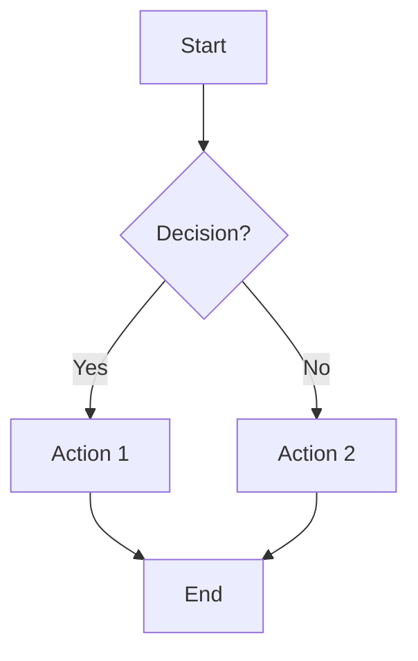

### 2. Sequence Diagram

**Use for**: API calls, user interactions, system communication

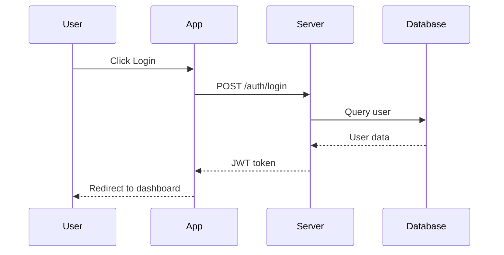

### 3. Architecture Diagram

**Use for**: System design, infrastructure, component relationships

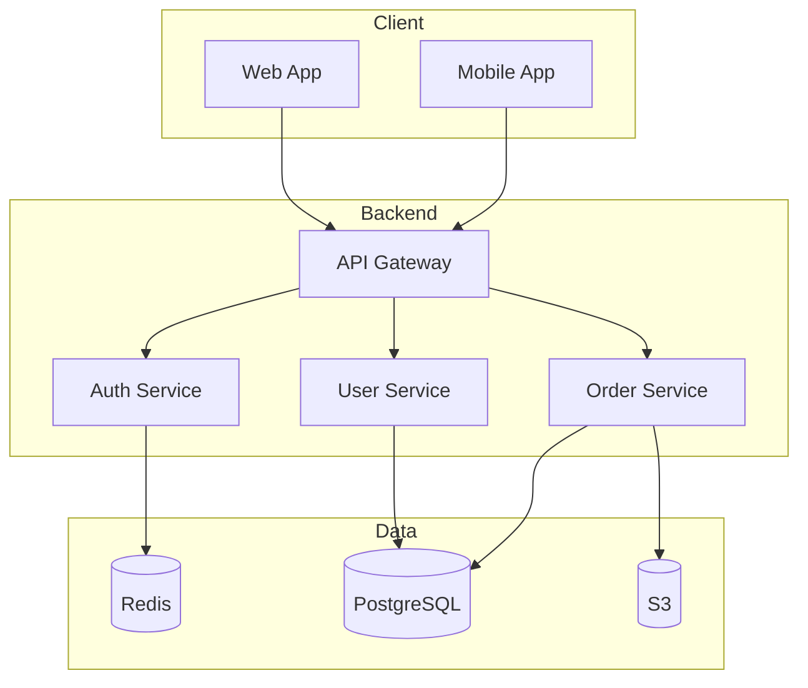

### 4. Entity-Relationship Diagram

**Use for**: Database design, data models

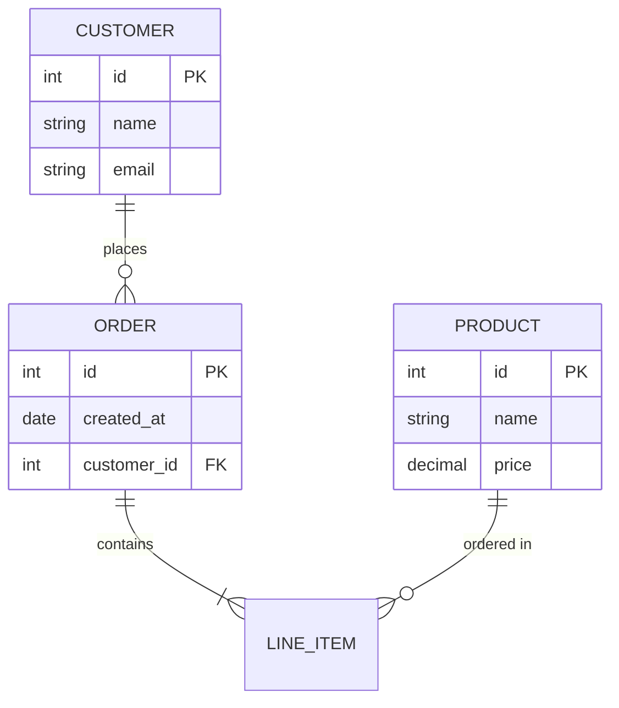

### 5. Class Diagram

**Use for**: OOP design, code structure

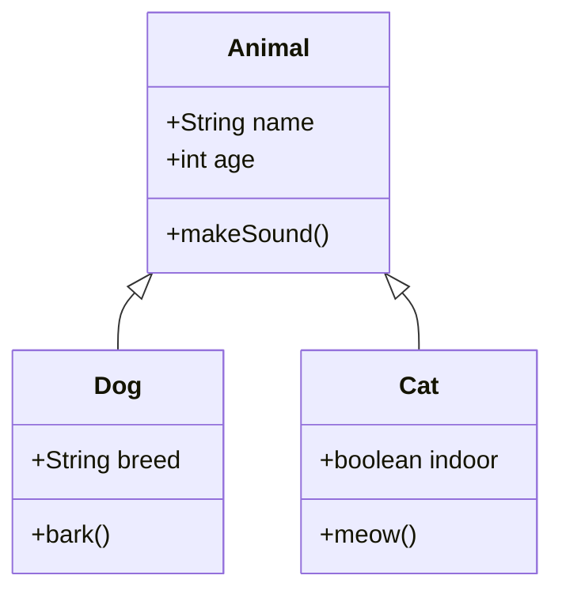

### 6. State Diagram

**Use for**: State machines, status workflows

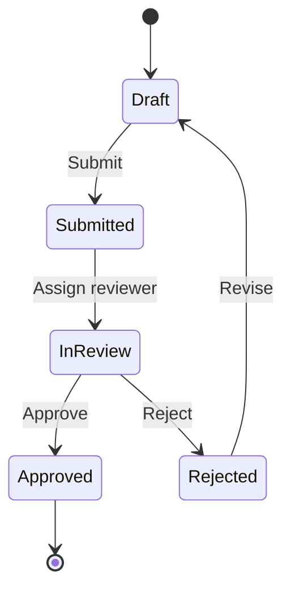

### 7. Gantt Chart

**Use for**: Project timelines, schedules

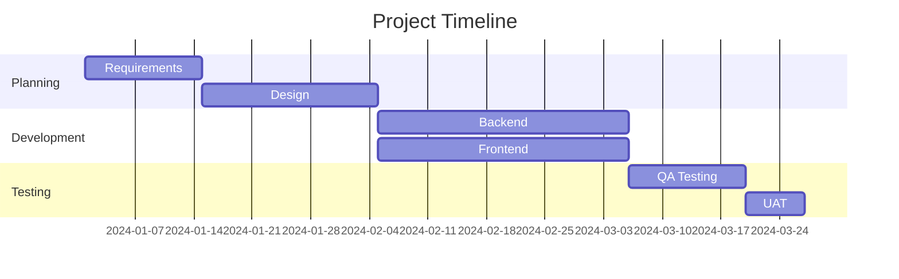

### 8. Mind Map

**Use for**: Brainstorming, concept organization

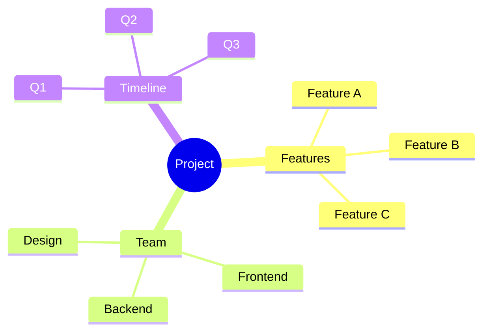

### 9. Git Graph

**Use for**: Branch visualization, git workflows

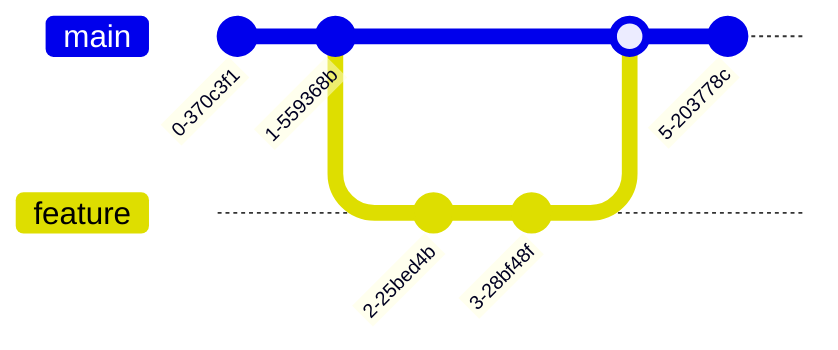

---

## Output Format

```markdown
# Diagram: [Name]

**Type**: [Flowchart / Sequence / Architecture / etc.]
**Tool**: [Mermaid / PlantUML]
**Purpose**: [What it illustrates]

---

## Diagram Code

### Mermaid

```mermaid
[Mermaid code here]
```

### PlantUML (Alternative)

```plantuml
[PlantUML code here]
```

---

## Rendering Instructions

1. **Mermaid Live Editor**: https://mermaid.live/
2. **GitHub**: Paste directly in markdown files
3. **VS Code**: Install Mermaid extension
4. **Notion**: Use code block with mermaid type

---

## Customization Options

### Color Theme
Add to the beginning:
```
%%{init: {'theme':'forest'}}%%
```

Available themes: default, forest, dark, neutral

### Direction
- TB (top to bottom)
- BT (bottom to top)
- LR (left to right)
- RL (right to left)

---

## Notes

- [Any notes about the diagram]
- [Assumptions made]
```

---

## PlantUML Examples

### Sequence Diagram
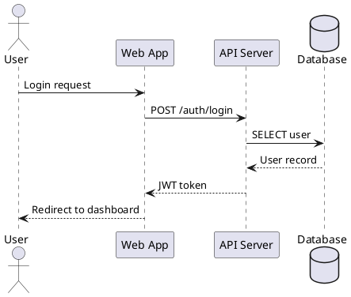

### Component Diagram
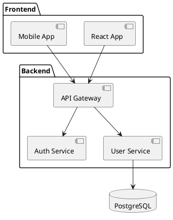

---

## Tips for Better Diagrams

1. **Keep it simple** - Don't overcrowd
2. **Use consistent naming** - Clear, descriptive labels
3. **Group related items** - Use subgraphs/packages
4. **Choose appropriate type** - Match diagram to concept
5. **Consider audience** - Technical vs. business
6. **Use colors sparingly** - For emphasis only
7. **Add legends** - When using symbols/colors
8. **Maintain hierarchy** - Top-down or left-right flow

---

## Rendering Tools

| Tool | URL | Best For |
|------|-----|----------|
| Mermaid Live | mermaid.live | Quick editing |
| PlantUML Server | plantuml.com | PlantUML rendering |
| Draw.io | draw.io | Manual editing |
| Excalidraw | excalidraw.com | Hand-drawn style |
| Lucidchart | lucidchart.com | Professional diagrams |

---

## Limitations

- Cannot render images directly
- Complex layouts may need manual adjustment
- Limited styling compared to design tools
- Some diagram types not supported in all tools

---

*Built by the Claude Office Skills community. Contributions welcome!*
